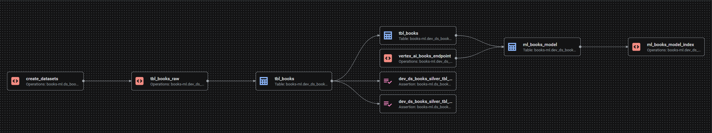
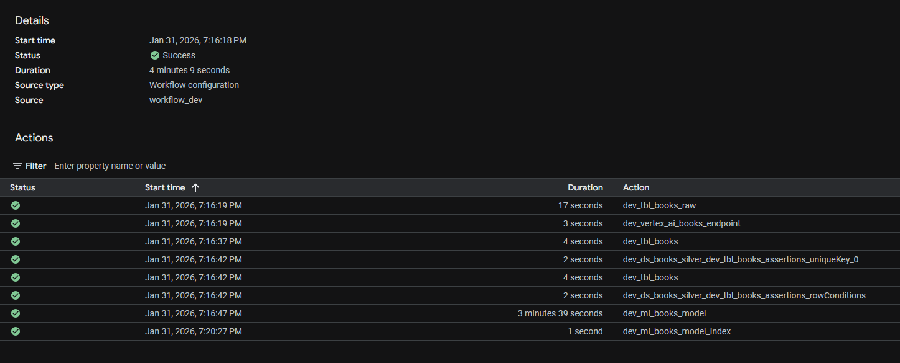
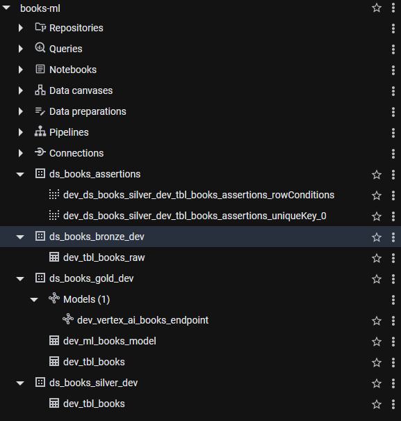
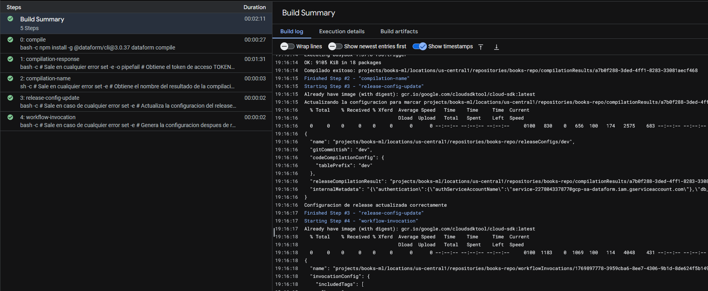
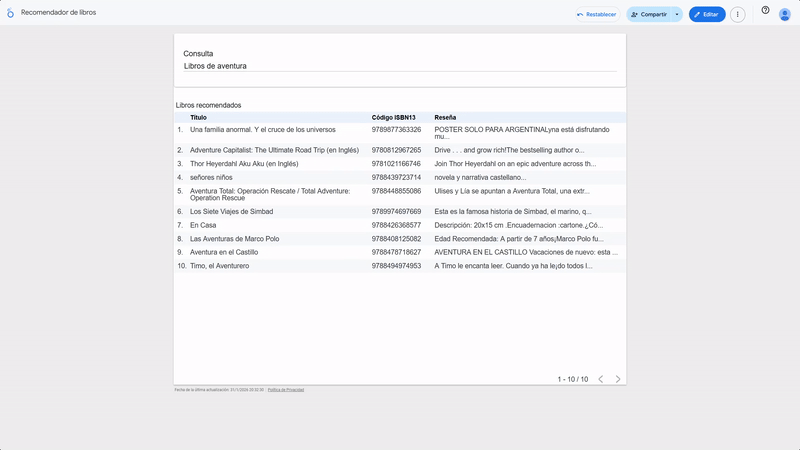

# ETL Books ML

Proyecto que utiliza Dataform para extraer, limpiar y cargar información de un conjunto de libros. Luego de esto genera embeddings en base a la reseña para posteriormente hacer un recomendador de libros en Looker Studio.

## Variables comunes

```sh
export PROJECT_ID="books-ml"
export REGION="us-central1"
export PROJECT_NUMBER=$(gcloud projects describe $PROJECT_ID --format="value(projectNumber)")

# Datasets "development" (opcional, se crean con Dataform)
BQ_DATASET_BRZ_DEV="dev_ds_books_bronze"
BQ_DATASET_SLV_DEV="dev_ds_books_silver"
BQ_DATASET_GLD_DEV="dev_ds_books_gold"

# Datasets "production" (opcional, se crean con Dataform)
BQ_DATASET_BRZ="ds_books_bronze"
BQ_DATASET_SLV="ds_books_silver"
BQ_DATASET_GLD="ds_books_gold"
```

## Habilitar APIs necesarias

```sh
gcloud services enable \
    cloudbuild.googleapis.com \
    compute.googleapis.com \
    storage.googleapis.com \
    secretmanager.googleapis.com \
    dataform.googleapis.com \
    aiplatform.googleapis.com
```

## Crear bucket

```sh
BUCKET_NAME="books-ml-input"

gcloud storage buckets create gs://${BUCKET_NAME} \
    --location=$REGION \
 --uniform-bucket-level-access
```

## Crear una cuenta de servicio para Dataform

```sh
gcloud iam service-accounts create dataform-app-sa \
  --description="Cuenta de servicio para Dataform"

SA_EMAIL_DF="dataform-app-sa@${PROJECT_ID}.iam.gserviceaccount.com"

gcloud projects add-iam-policy-binding $PROJECT_ID --member="serviceAccount:${SA_EMAIL_DF}" --role="roles/bigquery.jobUser"
gcloud projects add-iam-policy-binding $PROJECT_ID --member="serviceAccount:${SA_EMAIL_DF}" --role="roles/bigquery.dataEditor"
gcloud projects add-iam-policy-binding $PROJECT_ID --member="serviceAccount:${SA_EMAIL_DF}" --role="roles/storage.objectViewer"
gcloud projects add-iam-policy-binding $PROJECT_ID --member="serviceAccount:${SA_EMAIL_DF}" --role="roles/dataform.admin"
gcloud projects add-iam-policy-binding $PROJECT_ID --member="serviceAccount:${SA_EMAIL_DF}" --role="roles/dataform.editor"
gcloud projects add-iam-policy-binding $PROJECT_ID --member="serviceAccount:${SA_EMAIL_DF}" --role="roles/secretmanager.secretAccessor"
gcloud projects add-iam-policy-binding $PROJECT_ID --member="serviceAccount:${SA_EMAIL_DF}" --role="roles/bigquery.connectionAdmin"
```

## Permisos para la cuenta de servicio Dataform por defecto

```sh
SA_EMAIL_DF_DEFAULT="service-${PROJECT_NUMBER}@gcp-sa-dataform.iam.gserviceaccount.com"

gcloud projects add-iam-policy-binding $PROJECT_ID --member="serviceAccount:${SA_EMAIL_DF_DEFAULT}" --role="roles/iam.serviceAccountTokenCreator"
gcloud projects add-iam-policy-binding $PROJECT_ID --member="serviceAccount:${SA_EMAIL_DF_DEFAULT}" --role="roles/iam.serviceAccountUser"
```

## Crear repositorio y workspace Dataform

Este es un paso manual.

- Repository ID: `books-repo`
- Region: `${REGION}` (`us-central1`)
- Service account: `dataform-app-sa@${PROJECT_ID}.iam.gserviceaccount.com`
- actAs permissions check: `Default`

### Workspace

- Workspace ID: `books-repo-workspace`

### Conectar con Github

Seguir la documentación oficial

- https://docs.cloud.google.com/dataform/docs/connect-repository#github
- https://docs.github.com/en/authentication/connecting-to-github-with-ssh/generating-a-new-ssh-key-and-adding-it-to-the-ssh-agent

## Releases & scheduling para Dataform

Este es un paso manual.

Como referencia los nombres de las configuraciones deben coincidir con las variables del comando `--substitutions` del paso siguiente `Crear un trigger para Cloud Build`.

### Release configurations

#### Desarrollo

- Release ID: `dev`
- Schedule frequency: `On-demand`
- Table prefix: `dev`

Todo lo demás por defecto

#### Producción

- Release ID: `prod`
- Schedule frequency: `On-demand`
- Table prefix: `prd`

### Workflow configurations

#### Desarrollo

- Configuration ID: `workflow_dev`
- Release configuration: `dev`
- Authentication: `Execute with selected service account ...` (seleccionar cuenta creada para Dataform)
- Schedule frequency: `On-demand`
- Selection of tags: `bronze, silver, gold, and ml`

#### Producción

- Configuration ID: `workflow_prod`
- Release configuration: `prod`
- Authentication: `Execute with selected service account ...` (seleccionar cuenta creada para Dataform)
- Schedule frequency: `On-demand`
- Selection of tags: `bronze, silver, gold, and ml`

Todo lo demás por defecto

## Crear una cuenta de servicio para Cloud Build

```sh
gcloud iam service-accounts create cloudbuild-app-sa \
  --description="Cuenta de servicio para CloudBuild"

SA_EMAIL_CB="cloudbuild-app-sa@${PROJECT_ID}.iam.gserviceaccount.com"

gcloud projects add-iam-policy-binding $PROJECT_ID --member="serviceAccount:${SA_EMAIL_CB}" --role="roles/cloudbuild.builds.editor"
gcloud projects add-iam-policy-binding $PROJECT_ID --member="serviceAccount:${SA_EMAIL_CB}" --role="roles/logging.logWriter"
gcloud projects add-iam-policy-binding $PROJECT_ID --member="serviceAccount:${SA_EMAIL_CB}" --role="roles/dataform.admin"
gcloud projects add-iam-policy-binding $PROJECT_ID --member="serviceAccount:${SA_EMAIL_CB}" --role="roles/iam.serviceAccountUser"
gcloud projects add-iam-policy-binding $PROJECT_ID --member="serviceAccount:${SA_EMAIL_CB}" --role="roles/storage.admin"
```

## Crear un trigger para Cloud Build

Se asume que la conexión al repositorio ya se realizó.

Nota: Al enlazar un repositorio GCP da 2 opciones para "Repository name":

1. Generated
2. Manual

Cualquiera que se elija, el nombre que genere debe ser asignado en la opción `--repository` en la última sección `.../repositories/<NOMBRE_GENERADO_AL_ENLAZAR>`

```sh
# La conexion debe estar creada
GIT_CONN="github-connection"
GIT_REPO="etl_books_ml"

# Trigger para master
gcloud builds triggers create github \
  --name="books-ml-trigger-prod" \
  --repository="projects/${PROJECT_ID}/locations/${REGION}/connections/${GIT_CONN}/repositories/ericmartinezr-${GIT_REPO}" \
  --branch-pattern="^master$" \
  --build-config="cloudbuild.yaml" \
  --region=${REGION} \
  --substitutions=_ENV=prod,_DATAFORM_REPO_ID=books-repo,_RELEASE_CONFIG_ID=prod,_WORKFLOW_CONFIG_ID=workflow_prod \
  --service-account="projects/${PROJECT_ID}/serviceAccounts/${SA_EMAIL_CB}"

# Trigger para dev
gcloud builds triggers create github \
  --name="books-ml-trigger-dev" \
  --repository="projects/${PROJECT_ID}/locations/${REGION}/connections/${GIT_CONN}/repositories/ericmartinezr-${GIT_REPO}" \
  --branch-pattern="^dev$" \
  --build-config="cloudbuild.yaml" \
  --region=${REGION} \
  --substitutions=_ENV=dev,_DATAFORM_REPO_ID=books-repo,_RELEASE_CONFIG_ID=dev,_WORKFLOW_CONFIG_ID=workflow_dev \
  --service-account="projects/${PROJECT_ID}/serviceAccounts/${SA_EMAIL_CB}"
```

## Crear datasets

_Nota: Este paso también lo ejecuta Dataform en el archivo "create_datasets.sqlx"
por lo tanto es opcional hacerlo manualmente._

```sh
bq mk --dataset --location=$REGION $PROJECT_ID:$BQ_DATASET_BRZ_DEV
bq mk --dataset --location=$REGION $PROJECT_ID:$BQ_DATASET_SLV_DEV
bq mk --dataset --location=$REGION $PROJECT_ID:$BQ_DATASET_GLD_DEV
bq mk --dataset --location=$REGION $PROJECT_ID:$BQ_DATASET_BRZ
bq mk --dataset --location=$REGION $PROJECT_ID:$BQ_DATASET_SLV
bq mk --dataset --location=$REGION $PROJECT_ID:$BQ_DATASET_GLD
```

## Crear conexión desde BigQuery hacia Vertex AI

```sh
bq mk --connection --location=${REGION} --project_id=${PROJECT_ID} \
    --connection_type=CLOUD_RESOURCE "vertex-ai-conn"
```

## Listar conexiones para validar su creación

```sh
bq ls --connection --project_id=${PROJECT_ID} --location=${REGION}
```

## Obtener la cuenta de servicio de la conexión y asignarle permisos

_Nota: Esta cuenta se genera de forma automática al crear la conexión_

```sh
CONN_SA=$(bq show --connection --format=json \
  --location=${REGION} ${PROJECT_ID}.${REGION}.vertex-ai-conn \
  | jq -r '.cloudResource.serviceAccountId')

gcloud projects add-iam-policy-binding ${PROJECT_ID} --member="serviceAccount:${CONN_SA}" --role="roles/aiplatform.user"
```

## Consulta para revisar la creación de los índices

_Nota: antes de ejecutar el tag `ml` se debe usar la query a continuación.
Una vez que el `coverage_percentage` esté al 100 se puede ejecutar el resto, de otra forma es muy lento._

La creación de los índices puede tomar unos minutos.

```sql
-- Desarrollo
SELECT * FROM `books-ml.ds_books_gold_dev.INFORMATION_SCHEMA.VECTOR_INDEXES`

-- Produccion
SELECT * FROM `books-ml.ds_books_gold.INFORMATION_SCHEMA.VECTOR_INDEXES`
```

## Query de consulta personalizada en BigQuery

_Nota: Esta query también se encuentra en [looker_studio_custom_query.sql](looker_studio_custom_query.sql)_

```sql
WITH user_input AS (
  SELECT embedding
  FROM AI.GENERATE_EMBEDDING(
    MODEL `books-ml.ds_books_gold.vertex_ai_books_endpoint`,
    (SELECT CAST(@search_query AS STRING) AS content),
    STRUCT('RETRIEVAL_QUERY' AS task_type, 1024 AS output_dimensionality)
  )
)
SELECT
  base.title,
  base.resena,
  base.isbn13,
  (1 - distance) * 100 AS similarity_score
FROM
  VECTOR_SEARCH(
    TABLE `books-ml.ds_books_gold.ml_books_model`,
    'embedding',
    TABLE user_input,
    top_k => 10,
    options => '{"fraction_lists_to_search": 0.5}'
  )
ORDER BY similarity_score DESC
```

## Referencia

- https://docs.cloud.google.com/bigquery/docs/reference/standard-sql/bigqueryml-syntax-generate-embedding
- https://docs.cloud.google.com/bigquery/docs/reference/standard-sql/bigqueryml-syntax-ai-generate-embedding
- https://docs.cloud.google.com/bigquery/docs/reference/standard-sql/search_functions#vector_search
- https://docs.cloud.google.com/bigquery/docs/reference/standard-sql/bigqueryml-syntax-create-remote-model#connection
- https://docs.cloud.google.com/bigquery/docs/working-with-connections#bq_1
- https://docs.cloud.google.com/bigquery/docs/create-cloud-resource-connection#bq
- https://docs.cloud.google.com/bigquery/docs/reference/standard-sql/bigqueryml-syntax-generate-embedding
- https://docs.cloud.google.com/vertex-ai/generative-ai/docs/embeddings/get-text-embeddings#google-models
- https://docs.cloud.google.com/vertex-ai/generative-ai/docs/embeddings/task-types
- https://docs.cloud.google.com/dataform/docs/sql-workflows
- https://docs.cloud.google.com/dataform/docs/use-dataform-cli#before_you_begin
- https://docs.cloud.google.com/dataform/docs/best-practices-repositories
- https://docs.cloud.google.com/dataform/docs/managing-code-lifecycle#best_practices_for_isolated_execution_environments
- https://docs.cloud.google.com/dataform/docs/schedule-runs#create-build-config

<br><br>

# Evidencia ejecución

## Dataform

### Gráfico



### Ejecución



## BigQuery

### Estructura



## Cloud Build

### Ejecución



## Looker Studio

### Ejecución



[Video](images/lookerstudio.mp4)
